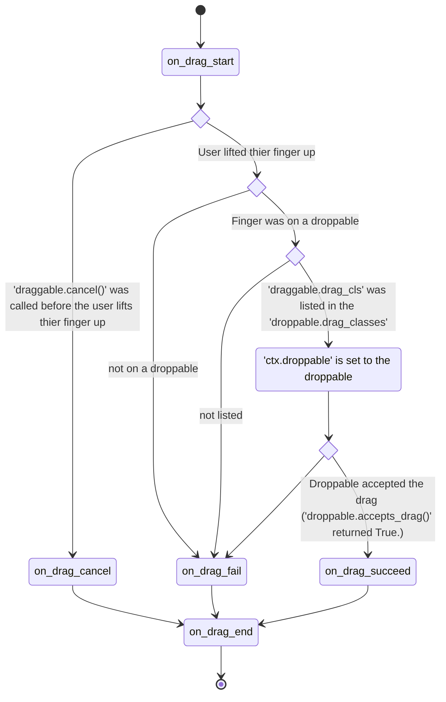

# Draggable

  
[Youtube][youtube]  
[README(Japanese)](README_jp.md)  

Inspired by:

* [drag_n_drop][drag_n_drop] (`Draggable` is based on this, so please read its documentation first to get the basic idea of this one)
* [Flutter][flutter]

This flower adds a drag and drop functionality to layouts and widgets. There are 3
main components used to have drag and drop:

- The `KXDraggableBehavior`. An equivalent of drag_n_drop's
  `DraggableObjectBehavior`.
- The `KXReorderableBehavior`. An equivalent of drag_n_drop's
  `DraggableLayoutBehavior`.
- The `KXDroppableBehavior`. An equivalent of Flutter's `DragTarget`.

From now on, I use the term `droppable` to refer both `KXReorderableBehavior` and `KXDroppableBehavior`, and use the term `draggable` to refer `KXDraggableBehavior`.

## Installation

It's recommended to pin the minor version, because if it changed, it means some important breaking changes occurred.

```
poetry add kivy_garden.draggable@~0.1
pip install "kivy_garden.draggable>=0.1,<0.2"
```

## Main differences from drag_n_drop

- Drag is triggered by a long-press. More precisely, when a finger of the user
  dropped inside a draggable, if the finger stays for `draggable.drag_timeout`
  milli seconds without traveling more than `draggable.drag_distance` pixels, it will
  be recognized as a dragging gesture.
- Droppables can handle multiple drags simultaneously.
- Drag can be cancelled by calling `draggable.drag_cancel()`.
- Nested `KXReorderableBehavior` is not officially supported. It may or may
  not work depending on how `drag_classes` and `drag_cls` are set.

## Flow

Once a drag has started, it will go through the following path.



## Cancellation

When your app switches a scene, you may want to cancel the all ongoing drags.
`ongoing_drags()` and `draggable.drag_cancel()` are what you want.

```python
from kivy_garden.draggable import ongoing_drags

def cancel_all_ongoing_drags():
    for draggable in ongoing_drags():
        draggable.drag_cancel()
```

## Using other widgets as an emitter

Let's say you are creating a card game, and there is a deck on the screen.
Say, you want the deck to emit a card when the user drops a finger on it,
and want the card to follow the finger until the user lifts it up.
In this situation, a widget who triggers a drag and a widget who is dragged are different.
You can implement it as follows:

```python
class Card(KXDraggableBehavior, Widget):
    pass


class Deck(Widget):
    def on_touch_down(self, touch):
        if self.collide_point(*touch.opos):
            Card(...).start_dragging_from_others_touch(self, touch)
```

## Customization

What draggables do `on_drag_succeed` / `on_drag_fail` / `on_drag_cancel` are completely customizable.
For example, by default, when a drag fails, the draggable will go back to where it came from with little animation.
This is because the default handler of `on_drag_fail` is implemented as follows:

```python
class KXDraggableBehavior:
    async def on_drag_fail(self, touch, ctx):
        await ak.animate(
            self, duration=.1,
            x=ctx.original_pos_win[0],
            y=ctx.original_pos_win[1],
        )
        restore_widget_location(self, ctx.original_location)
```

If you don't need the animation, and want the draggable to go back instantly, overwrite the handler as follows:

```python
class MyDraggable(KXDraggableBehavior, Widget):
    def on_drag_fail(self, touch, ctx):
        restore_widget_location(self, ctx.original_location)
```

Or if you want the draggable to not go back, and want it to stay the current position, overwrite the handler as follows:

```python
class MyDraggable(KXDraggableBehavior, Widget):
    def on_drag_fail(self, touch, ctx):
        pass
```

Another example: when a drag succeed, the draggable will become a child of droppable, by default.
If you don't like it, and want the draggable to fade-out,
overwrite the handler as follows:

```python
class MyDraggable(KXDraggableBehavior, Widget):
    async def on_drag_succeed(self, touch, ctx):
        import asynckivy
        await asynckivy.animate(self, opacity=0)
        self.parent.remove_widget(self)
```

Just like that, you have free rein to change those behaviors.
But note that **only the default handler of `on_drag_succeed` and `on_drag_fail`
can be an async function. Those two only.**

You might say "What's the point of implementing a default handler as an async function,
when you can just launch any number of tasks from regular function by using ``asynckivy.start()``?".
Well, if you use ``asynckivy.start()``, that task will run independently from the dragging process,
which means the draggable might fire ``on_drag_end`` and might start another drag while the task is still running.
If a default handler is an async function,
its code will be a part of dragging process and is guaranteed to be finished before ``on_drag_end`` gets fired.

## License

This software is released under the terms of the MIT License.

[drag_n_drop]:https://github.com/kivy-garden/drag_n_drop
[flutter]:https://api.flutter.dev/flutter/widgets/Draggable-class.html
[youtube]:https://www.youtube.com/playlist?list=PLNdhqAjzeEGiepWKfP43Dh7IWqn3cQtpQ
