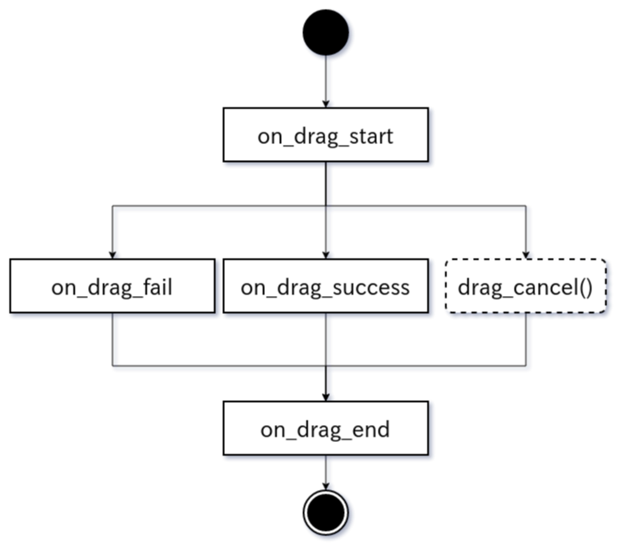

# Draggable

[][youtube]

Inspired by:

* [drag_n_drop][drag_n_drop]
* [Flutter][flutter]

(This flower is based on drag_n_drop, so reading its documentation may help
you understanding this one. And if you can read Japanese, [this][jpdoc] also
may help you.)

This flower adds a drag and drop functionality to layouts and widgets. There are 3
main components used to have drag and drop:

- The `KXDraggableBehavior`. An equivalent of drag_n_drop's
  `DraggableObjectBehavior`.
- The `KXReorderableBehavior`. An equivalent of drag_n_drop's
  `DraggableLayoutBehavior`.
- The `KXDroppableBehavior`. An equivalent of Flutter's `DragTarget`.

## Main differences from drag_n_drop

- Drag is triggered by a long-press. More precisely, when a finger of the user
  touched inside of a draggable widget, if the finger stays for `drag_timeout`
  milli seconds without traveling more than `drag_distance` pixels, it will
  be recognized as a dragging gesture.
- `KXReorderableBehavior` can handle multiple drags simultaneously.
- Drag can be cancelled by calling `KXDraggableBehavior.drag_cancel()`.
- Nested `KXReorderableBehavior` is not officially supported. It may or may
  not work depending on how `drag_classes` and `drag_cls` are set.

## Detail

### Flow

Once a drag has started, it will pass one of the following three paths:

- If the draggable gets dropped to a droppable(widget that inherits from
  either `KXDroppableBehavior` or `KXReorderableBehavior`), and gets
  accepted by it, the draggable will fire **on_drag_success** event. And
  `KXDraggableBehavior.drag_context.droppable` will be set to the droppable.
- If the draggable gets dropped to a non-droppable, the draggable will fire
  **on_drag_fail** event. And `KXDraggableBehavior.drag_context.droppable`
  will be None.
- If the draggable gets dropped to a droppable, but the `draggable.drag_cls`
  is not listed in the `droppable.drag_classes`, the draggable will fire
  **on_drag_fail** event. And `KXDraggableBehavior.drag_context.droppable`
  will be None.
- If the draggable gets dropped to a droppable, and gets denied by it,
  the draggable will fire **on_drag_fail** event. And
  `KXDraggableBehavior.drag_context.droppable` will be set to the draggable.
  ("gets denied" means `droppable.accepts_drag()` returned False)
- If `draggable.drag_canel()` is called before the user lift off his/her
  finger, neither of **on_drag_fail** nor **on_drag_success** will be fired.
  And `KXDraggableBehavior.drag_context.cancelled` will be set to True.

## License

This software is released under the terms of the MIT License.
Please see the [LICENSE.txt](LICENSE.txt) file.

[drag_n_drop]:https://github.com/kivy-garden/drag_n_drop
[flutter]:https://api.flutter.dev/flutter/widgets/Draggable-class.html
[jpdoc]:https://qiita.com/gotta_dive_into_python/private/b7957650b64a89783ea0
[youtube]:https://www.youtube.com/playlist?list=PLNdhqAjzeEGiepWKfP43Dh7IWqn3cQtpQ
