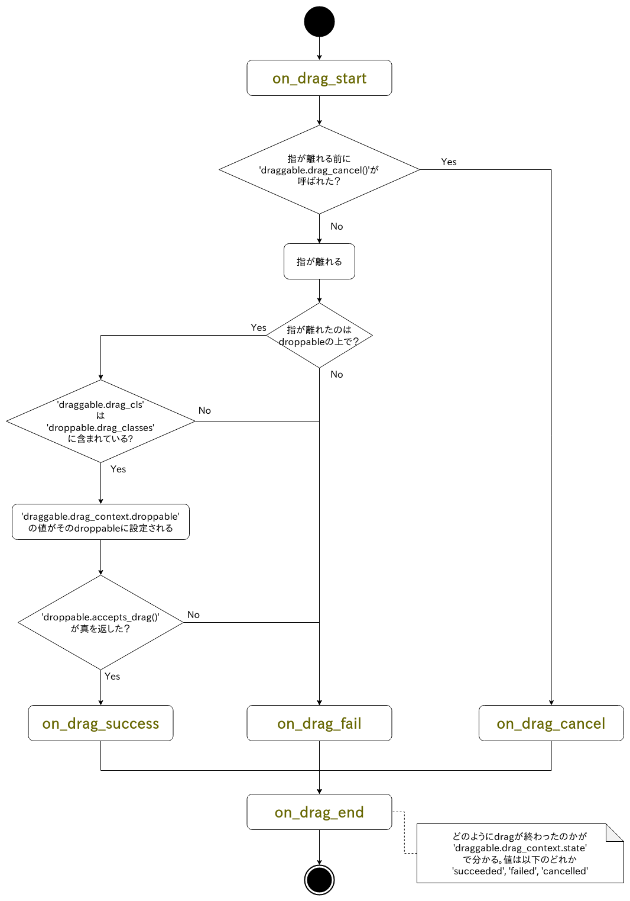

# Draggable

`kivy_garden.draggable`はdrag&dropの機能を実現するための拡張機能で以下の三つの部品で構成される。

- `KXDraggableBehavior` ... dragできるようにしたいwidgetが継承すべきclass
- `KXDroppableBehavior`と`KXReorderableBehavior` ... dragされているwidgetを受け入れられるようにしたいwidgetが継承すべきclass

`KXDroppableBehavior`と`KXReorderableBehavior`の違いはFlutterにおける[DragTarget][flutter_draggable_video]と[reorderables][flutter_reorderables]の違いに相当し、drag操作によってwidgetを並び替えたいなら`KXReorderableBehavior`を、そうじゃなければ`KXDroppableBehavior`を使うと良い。これらの名前は長ったらしいので以後は、dragを受け入れられるwidgetをまとめて「droppable」と呼び、dragできるwidgetを「draggable」と呼ぶ。

## dragが始まる条件

dragは長押しによって引き起こされる。より具体的には利用者の指がdraggable内に降りてから`draggable.drag_distance`pixel以上動かずに`draggable.drag_timeout`ミリ秒以上指が離れなかった場合のみ引き起こされる。このためscroll操作(指がすぐさま動き出す)やtap動作(指がすぐに離れる)として誤認されにくい。


## 受け入れるdraggableの選別

利用者の指が離れた時にdragが受け入れられるか否かの判断がなされる。
指がdroppableの上じゃない所で離れた場合、`draggable.drag_cls`が`droppable.drag_classes`に含まれていない場合はまず即drag失敗となる。

上の選別をくぐり抜けたdraggableは`droppable.accepts_drag()`へ渡され、そこで受け入れられるかどうかの最終判断が下される。例えばmethodが

```python
class MyDroppable(KXDroppableBehavior, Widget):
    def accepts_drag(self, touch, draggable) -> bool:
        return not self.children
```

という風に実装されていたら、このdroppableは自分が子を持っている間はいかなるdragも受け付けない事になる。

そしてmethodが真を返してくれた時のみdragは成功となる。

## 中止

アプリが次のシーンに移りたい時にまだdrag中のwidgetがあると不都合かもれしない。そのような事態に備えてdraggableには

- 現在進行中のdragを列挙する`.ongoing_drags()`と
- dragを中止する`.drag_cancel()`がある。

これらを用いる事で以下のように進行中のdragを全て中止できる。

```python
def cancel_all_ongoing_drags():
    for draggable in tuple(KXDraggableBehavior.ongoing_drags()):
        draggable.drag_cancel()
```

## 処理の流れの図



## 振る舞いの変更

dragが失敗/成功/中止した時に何をするかは完全にあなたに委ねられている。例えばdrag失敗時は既定ではアニメーションしながら元の場所に戻るが、これをアニメーション無しで瞬時に元の場所へ戻したいなら以下のように上書きすればよい。

```python
from kivy_garden.draggable import restore_widget_location

class MyDraggable(KXDraggableBehavior, Widget):
    def on_drag_fail(self, touch, draggable):
        restore_widget_location(self, self.drag_context.original_location)
```

何もせずにその場に残って欲しいなら以下のようにすれば良い。

```python
class MyDraggable(KXDraggableBehavior, Widget):
    def on_drag_fail(self, touch, draggable):
        pass
```

成功時も同様で、既定では受け入れてくれたdroppableの子widgetになるように実装されているが以下のようにすれば子widgetにはならずに現在の位置で徐々に透明になって消える事になる。

```python
import asynckivy as ak

class MyDraggable(KXDraggableBehavior, Widget):
    async def on_drag_success(self, touch, draggable):
        await ak.animate(self, opacity=0)
        self.parent.remove_widget(self)
```

このようにdefault handlerを上書きすることで自由に振るまいを変えられる。
ただし**async関数が使えるのは`on_drag_success`と`on_drag_fail`のdefault handlerだけ**なので注意してください。

## その他

- [drag_n_drop][drag_n_drop] ... これの元になった物

[flutter_draggable_video]:https://youtu.be/QzA4c4QHZCY
[flutter_reorderables]:https://pub.dev/packages/reorderables
[drag_n_drop]:https://github.com/kivy-garden/drag_n_drop
