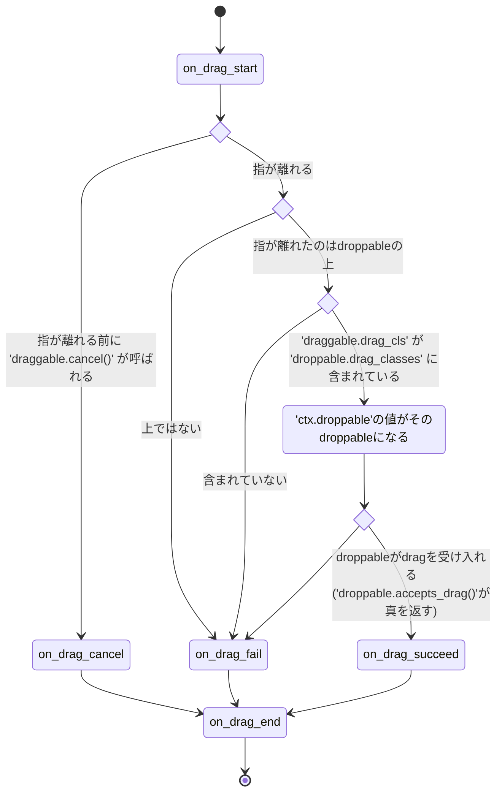

# Draggable

  
[Youtube][youtube]  

`kivy_garden.draggable`はdrag&dropの機能を実現するための拡張機能で以下の三つの部品で構成される。

- `KXDraggableBehavior` ... dragできるようにしたいwidgetが継承すべきclass
- `KXDroppableBehavior`と`KXReorderableBehavior` ... dragされているwidgetを受け入れられるようにしたいwidgetが継承すべきclass

`KXDroppableBehavior`と`KXReorderableBehavior`の違いはFlutterにおける[DragTarget][flutter_draggable_video]と[reorderables][flutter_reorderables]の違いに相当し、drag操作によってwidgetを並び替えたいなら`KXReorderableBehavior`を、そうじゃなければ`KXDroppableBehavior`を使うと良い。これらの名前は長ったらしいので以後は、dragを受け入れられるwidgetをまとめて「droppable」と呼び、dragできるwidgetを「draggable」と呼ぶ。

## Install方法

このmoduleのminor versionが変わった時は何らかの重要な互換性の無い変更が加えられた可能性が高いので、使う際はminor versionまでを固定してください。

```
poetry add kivy_garden.draggable@~0.1
pip install "kivy_garden.draggable>=0.1,<0.2"
```

## dragが始まる条件

dragは長押しによって引き起こされる。より具体的には利用者の指がdraggable内に降りてから`draggable.drag_distance`pixel以上動かずに`draggable.drag_timeout`ミリ秒以上指が離れなかった場合のみ引き起こされる。このためscroll操作(指がすぐさま動き出す)やtap動作(指がすぐに離れる)として誤認されにくい。

## dragが始まった後の処理の流れ

ユーザーがdraggableの上に指を降ろしてdragが始まった後の流れは以下のようになる。



## 受け入れるdragの選別

図に書かれているように利用者の指が離れた時にdragが受け入れられるか否かの判断がなされ、
指がdroppableの上じゃない所で離れた場合や`draggable.drag_cls`が`droppable.drag_classes`に含まれていない場合はまず即drag失敗となる。

その選別をくぐり抜けたdraggableは`droppable.accepts_drag()`へ渡され、そこでdragが受け入れられるか否かの最終判断が下される。例えばmethodが

```python
class MyDroppable(KXDroppableBehavior, Widget):
    def accepts_drag(self, touch, draggable) -> bool:
        return not self.children
```

という風に実装されていたら、このdroppableは自分が子を持っている間は例え適切な`drag_cls`を持つdraggableであっても受け付けない。

## dragの中止

アプリが次のシーンに移りたい時にまだdrag中のwidgetがあると不都合かもれしない。そのような事態に備えて

- 現在進行中のdragを列挙する`ongoing_drags()`と
- dragを中止する`draggable.drag_cancel()`がある。

これらを用いる事で以下のように進行中のdragを全て中止できる。

```python
from kivy_garden.draggable import ongoing_drags

def cancel_all_ongoing_drags():
    for draggable in ongoing_drags():
        draggable.drag_cancel()
```

## dragを引き起こすwidgetとdragされるwidgetを別にする

上で述べたようにdragはdraggableを長押しすることで引き起こされるので、
dragを引き起こすwidgetとdragされるwidgetは基本同じである。
でも例えばcard gameを作っているとして画面上に山札があったとする。
そしてdrag操作によって山札から札を引けるようにしたいとする。
具体的には利用者が山札に指を触れた時に札を作り出し、
そのまま指の動きに沿って札を追わせたいとする。
このような

- dragを引き起こすwidget(山札)と
- dragされるwidget(山札から引かれた札)

が別である状況では`draggable.start_dragging_from_others_touch()`が使える。

```python
class Card(KXDraggableBehavior, Widget):
    '''札'''

class Deck(Widget):
    '''山札'''
    def on_touch_down(self, touch):
        if self.collide_point(*touch.opos):
            Card(...).start_dragging_from_others_touch(self, touch)
```

## 自由に振る舞いを変える

dragが失敗/成功/中止した時に何をするかは完全にあなたに委ねられている。例えばdrag失敗時は既定ではアニメーションしながら元の場所に戻るが、これをアニメーション無しで瞬時に戻したいなら以下のようにdefault handlerを上書きすれば良い。

```python
class MyDraggable(KXDraggableBehavior, Widget):
    def on_drag_fail(self, touch, ctx):
        restore_widget_location(self, ctx.original_location)
```

また何もせずにその場に残って欲しいなら以下のようにすれば良い。

```python
class MyDraggable(KXDraggableBehavior, Widget):
    def on_drag_fail(self, touch, ctx):
        pass
```

成功時も同様で、既定では受け入れてくれたdroppableの子widgetになるように実装されているが以下のようにすれば子widgetにはならずに現在の位置で徐々に透明になって消える事になる。

```python
import asynckivy as ak

class MyDraggable(KXDraggableBehavior, Widget):
    async def on_drag_succeed(self, touch, ctx):
        await ak.animate(self, opacity=0)
        self.parent.remove_widget(self)
```

このようにdefault handlerを上書きすることで自由に振るまいを変えられる。
ただし**async関数になれるのは`on_drag_succeed`と`on_drag_fail`のdefault handlerだけ**なので注意されたし。

ここで

- default handlerをasync関数にするのと
- default handlerは普通の関数のままにしておいて内部で`asynckivy.start()`を用いてasync関数を立ち上げるのと

の違いについて説明する。
前者ではasync関数のcodeがdrag処理の間に挟み込まれ、codeが`on_drag_end`が起こるより前に完遂される事が保証されるのに対し、
後者ではcodeがdrag処理とは独立して進むので`on_drag_end`が起こるより前に完了する保証はない。
なのでもし上の`on_drag_succeed`の例を後者のやり方で実装すると

```python
import asynckivy as ak

class MyDraggable(KXDraggableBehavior, Widget):
    def on_drag_succeed(self, touch, ctx):
        ak.start(self._fade_out(touch))

    async def _fade_out(self, touch):
        await ak.animate(self, opacity=0)
        self.parent.remove_widget(self)
```

`ak.animate()`の進行中にdragが完了し、そこで利用者が再び指を触れたことで次のdragが始まり、
その最中に`self.parent.remove_widget(self)`が実行されてdraggableが親widgetから切り離されてしまうなんて事が起こりうる。
なので **drag完了前に完遂させたい非同期処理があるのなら必ず前者の方法を使うべし**。

## その他

- [drag_n_drop][drag_n_drop] ... この拡張機能の元になった物

[flutter_draggable_video]:https://youtu.be/QzA4c4QHZCY
[flutter_reorderables]:https://pub.dev/packages/reorderables
[drag_n_drop]:https://github.com/kivy-garden/drag_n_drop
[youtube]:https://www.youtube.com/playlist?list=PLNdhqAjzeEGiepWKfP43Dh7IWqn3cQtpQ
